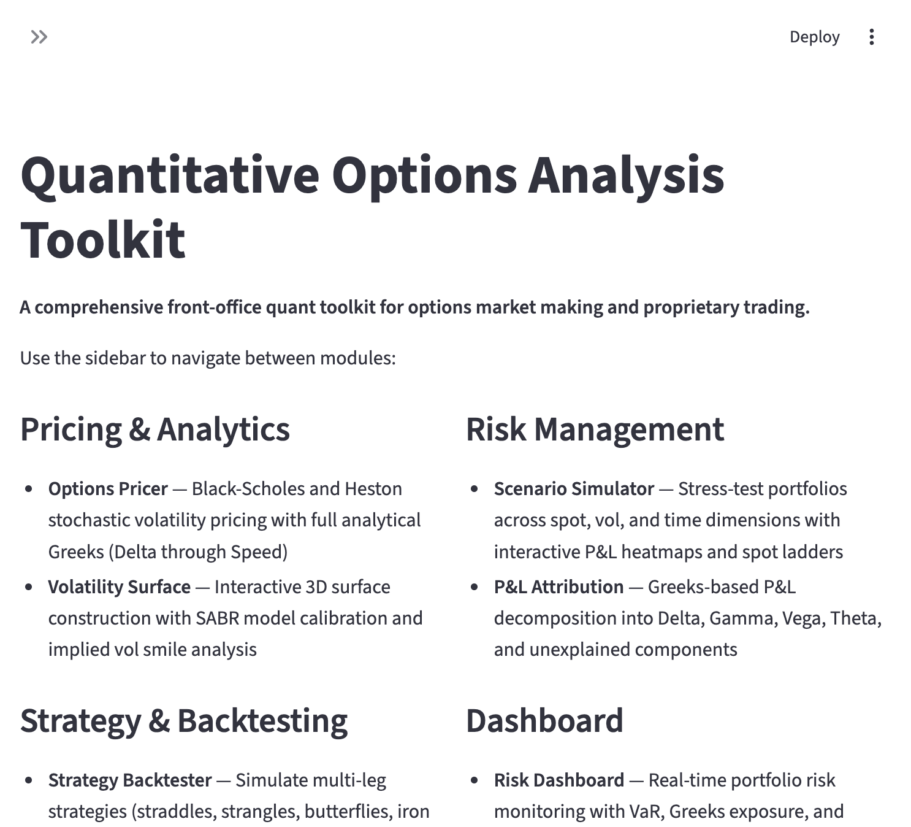
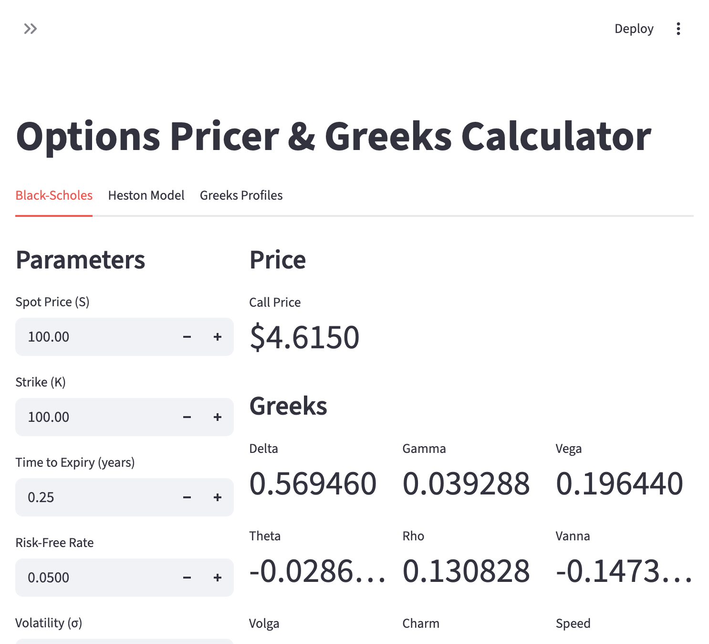
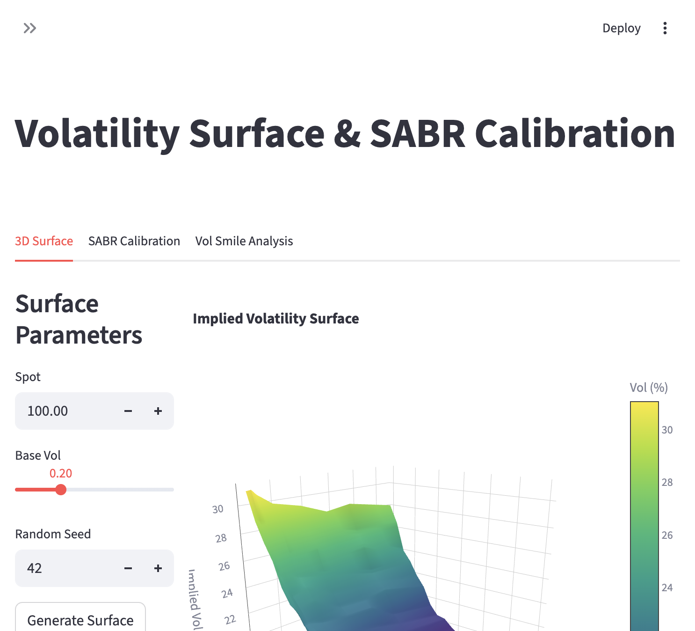
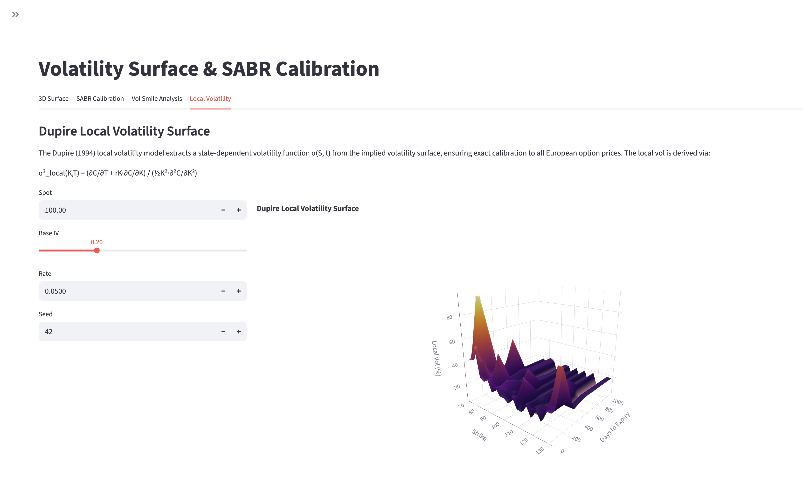
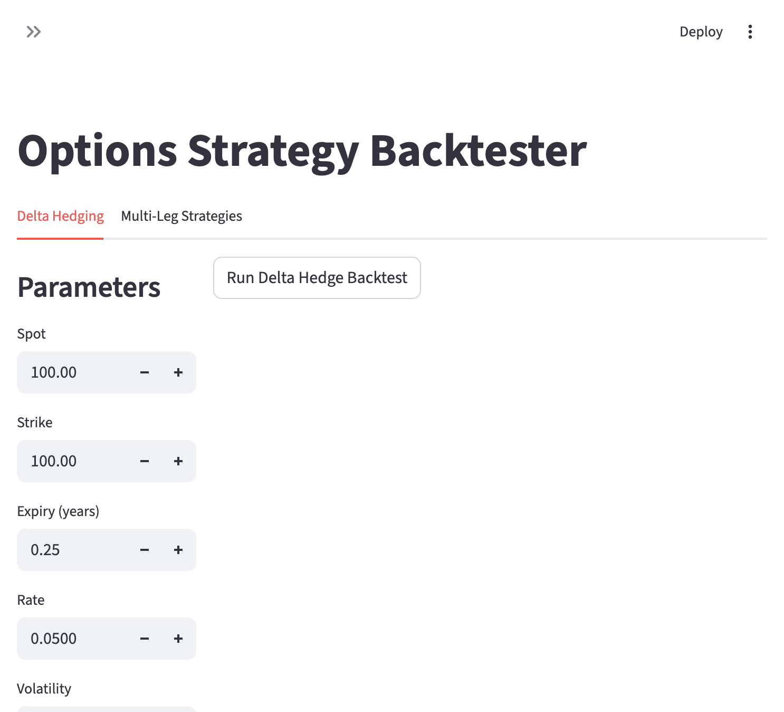
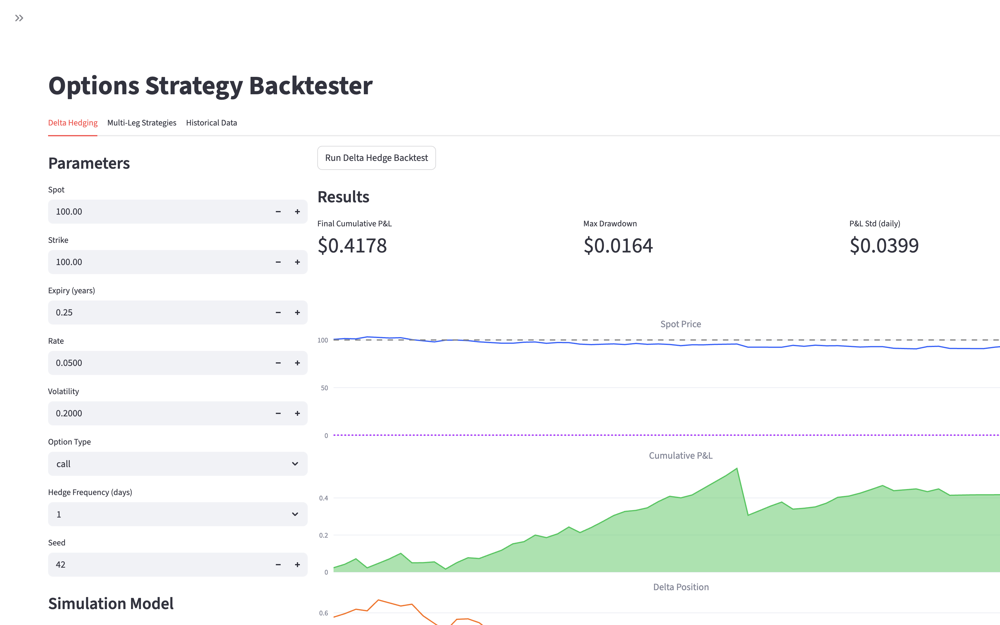
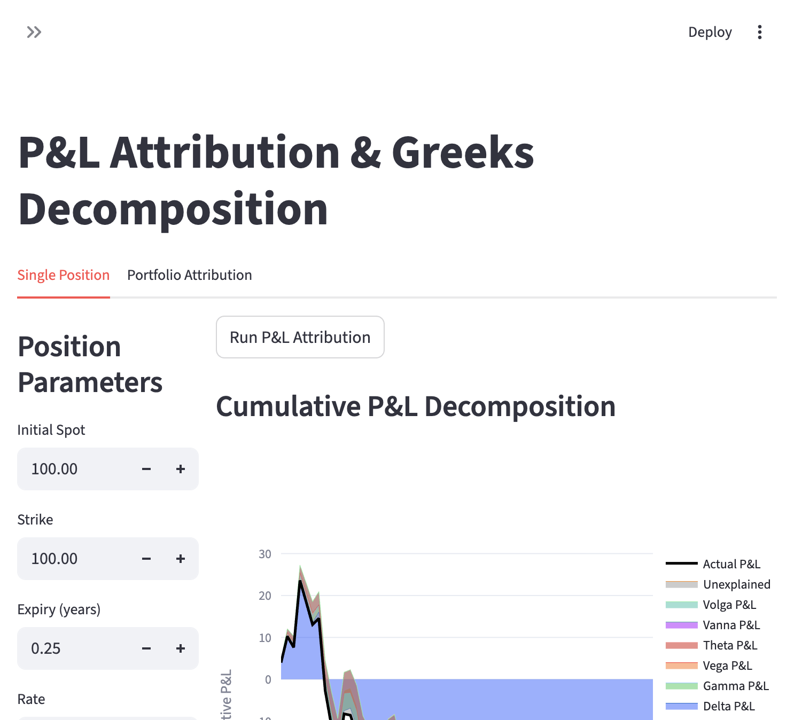
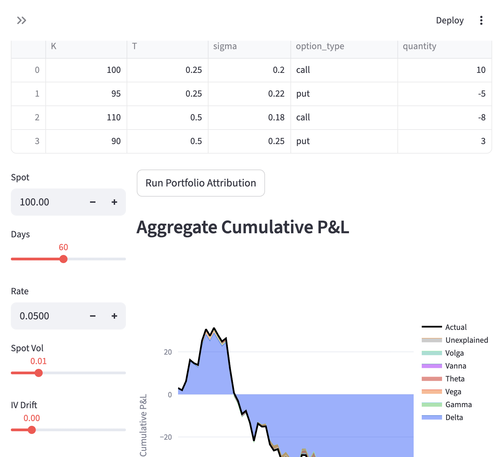
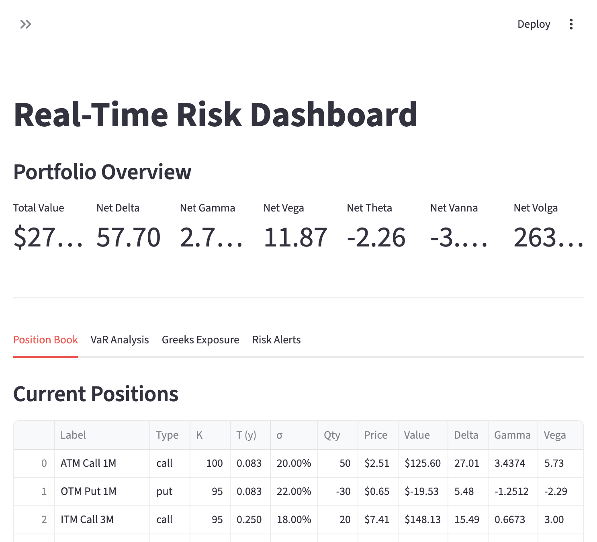

# Quantitative Options Analysis Toolkit (QOAT)

A containerized, interactive platform for front-office derivatives analytics — covering the full workflow from real-time market data through options pricing, volatility calibration, strategy backtesting, P&L attribution, risk monitoring, index options analysis, and broker-connected trading.



## Features

### Real-Time Market Data

Live market data integration powered by yfinance with TTL caching. Every tool page has a **ticker dropdown** in the sidebar — select a ticker, click "Load Live Data", and all inputs (spot, strike, volatility, risk-free rate) auto-populate from the market.

- **Live quotes** with price, change, volume, market cap, bid/ask, 52-week range
- **Historical OHLCV** candlestick charts across 9 time periods (1D–MAX)
- **Options chains** enriched with Black-Scholes Greeks
- **Implied volatility surfaces** built from real options data (3D surface, heatmap, ATM term structure)
- **Market overview** of major indices (S&P 500, Nasdaq, Dow, Russell, VIX, 10Y Treasury)
- **Risk-free rate** estimation from US Treasury yields
- 34 pre-configured popular tickers (AAPL, NVDA, SPY, QQQ, etc.) available across all pages

### Options Pricer & Greeks Calculator

Three pricing models with nine analytical Greeks and multi-dimensional sensitivity profiles. Inputs auto-populate from live market data.

- **Black-Scholes** closed-form pricing with implied volatility solver (Brent's method)
- **Heston stochastic volatility** via characteristic function integration
- **Dupire local volatility** extraction with Monte Carlo pricing
- Analytical Greeks: Delta, Gamma, Vega, Theta, Rho, Vanna, Volga, Charm, Speed
- Sensitivity profiles across spot, time-to-expiry, and volatility dimensions



### Volatility Surface & SABR Calibration

3D implied and local volatility surface construction with parametric calibration. Base vol and spot default to live ATM IV and market price.

- Cubic spline interpolation across strikes and expiries
- **SABR model** calibration (Hagan et al., 2002) via Nelder-Mead optimization
- **Dupire local vol** surface extraction from implied vol, with comparison views and heatmaps
- Vol smile analysis by expiry slice




### Index Options Analytics

Dedicated tooling for cash-settled, European-style index options (SPX, NDX, RUT, VIX, XSP, DJX) with contract-specific pricing and analysis.

- **European pricer** with continuous dividend yield (Merton model) and cash settlement P&L scenarios
- **Put-call parity** checker with violation detection, arbitrage signals, and implied dividend yield extraction
- **Term structure** of ATM implied volatility across expiries with **forward volatility** computation
- **Skew analysis** — 25-delta risk reversal, butterfly spread, slope, and smile curvature across multiple expiries
- **VIX options** pricing via **Black '76** on estimated VIX futures, with futures term structure (mean-reversion model) and 3D price surface
- **Expiry calendar** — monthly, quarterly, and weekly expiry dates with contract specification reference table
- **Section 1256 tax calculator** — 60/40 long-term/short-term blended rate with savings comparison vs equity options
- Full contract specs: multipliers, AM/PM settlement, exchange, exercise style

### Strategy Backtester

Delta hedging and multi-leg strategy evaluation under simulated or historical market data. Spot, vol, and rate default to live values for the selected ticker.

- Delta hedging under **GBM** or **Heston** dynamics (with vol mismatch analysis)
- 8 pre-built strategy templates: Long/Short Straddle, Strangle, Bull Call Spread, Bear Put Spread, Butterfly, Iron Condor, Calendar Spread
- Per-leg expiry and volatility parameters for multi-expiry structures
- **Historical data backtesting** via CSV upload with automatic price column detection




### Scenario Simulator & Stress Testing

Portfolio-level what-if analysis across multiple risk dimensions. Portfolio positions initialize with live market parameters.

- Spot x Vol P&L heatmaps
- 10 pre-configured stress scenarios (crash, rally, tail risk, time decay)
- Spot ladder and theta decay projections

### P&L Attribution

Full second-order Taylor decomposition for single positions and multi-position portfolios. Spot, strike, vol, and rate populate from live data.

- Six Greek components: Delta, Gamma, Vega, Theta, **Vanna**, **Volga**
- Cumulative stacked area charts, daily breakdowns, Greeks evolution
- **Portfolio-level attribution** across multiple positions sharing the same underlying
- Summary statistics with annualized Sharpe ratio




### Risk Dashboard

Real-time portfolio monitoring with VaR, Greeks exposure, and configurable alerts. Loading live data regenerates the entire position book with real spot, vol, and rate for the selected ticker.

- Monte Carlo **VaR / CVaR** at configurable confidence levels (90%–99%)
- Greeks exposure breakdown by expiry bucket and strike bucket
- Configurable risk limits with breach notifications



### Broker Integration & Trading

Unified trading interface with support for multiple brokers and a zero-dependency paper trading simulator.

- **Paper Trading** — built-in simulated broker with configurable starting capital, instant fills, position tracking, trade log, and account reset
- **Interactive Brokers (IBKR)** — via `ib_async` connecting to TWS or IB Gateway (port 7496 live / 7497 paper)
- **Alpaca** — via `alpaca-py` for equities and crypto with API key authentication
- **Schwab** — via `schwab-py` with OAuth flow for equities and options
- **Order management** — market, limit, stop, and stop-limit orders with real-time status tracking
- **Position monitoring** — current holdings with unrealized P&L, market value, and cost basis
- **Trade analytics** — order history, fill distribution, volume by symbol, and capital allocation charts
- Abstract `BrokerBase` interface for adding custom broker integrations

## Quick Start

### With Docker (recommended)

```bash
cd quant-tool/
docker compose up --build -d
```

Open [http://localhost:8501](http://localhost:8501) in your browser.

### Without Docker

```bash
cd quant-tool/
pip install -r requirements.txt
streamlit run Home.py
```

### Broker Setup (optional)

Broker SDK packages are optional — install only the ones you need:

```bash
pip install ib_async       # Interactive Brokers
pip install alpaca-py      # Alpaca Markets
pip install schwab-py      # Charles Schwab
```

Paper Trading requires no additional dependencies.

### Stopping

```bash
docker compose down
```

## Project Structure

```
quant-tool/
├── Home.py                      # Entry point and navigation
├── pages/
│   ├── 1_Options_Pricer.py      # BS, Heston, Local Vol pricing + Greeks
│   ├── 2_Volatility_Surface.py  # 3D surface, SABR, Dupire local vol
│   ├── 3_Strategy_Backtester.py # Delta hedge, strategies, historical data
│   ├── 4_Scenario_Simulator.py  # Stress testing and P&L heatmaps
│   ├── 5_PnL_Attribution.py     # Single-position and portfolio P&L
│   ├── 6_Risk_Dashboard.py      # VaR, Greeks exposure, risk alerts
│   ├── 7_Market_Data.py         # Live quotes, charts, options, IV surface
│   ├── 8_Index_Options.py       # Index options analytics and VIX pricing
│   └── 9_Broker.py              # Broker integration and trading
├── core/
│   ├── pricing.py               # BS, Heston, Local Vol pricing engines
│   ├── greeks.py                # Analytical and numerical Greeks
│   ├── volatility.py            # SABR, vol surface, Dupire local vol
│   ├── backtesting.py           # GBM/Heston simulation, strategy engines
│   ├── scenarios.py             # Scenario and stress testing
│   ├── pnl.py                   # P&L attribution engine
│   ├── market_data.py           # Live quotes, options chains, IV surfaces
│   ├── index_options.py         # Index options pricing, skew, term structure
│   └── broker.py                # Broker abstraction layer (IBKR, Alpaca, Schwab)
├── screenshots/                 # UI screenshots for documentation
├── Dockerfile
├── docker-compose.yml
└── requirements.txt
```

The `core/` modules are independent of Streamlit and can be imported into Jupyter notebooks or used as a standalone library.

## Tech Stack

| Component | Technology |
|-----------|-----------|
| Language | Python 3.11 |
| Web Framework | Streamlit |
| Market Data | yfinance |
| Numerical | NumPy, SciPy |
| Data | Pandas |
| Visualization | Plotly |
| Brokers | ib_async, alpaca-py, schwab-py (optional) |
| Containerization | Docker |
