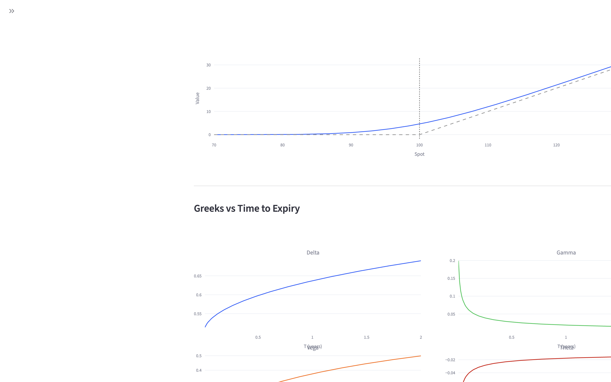
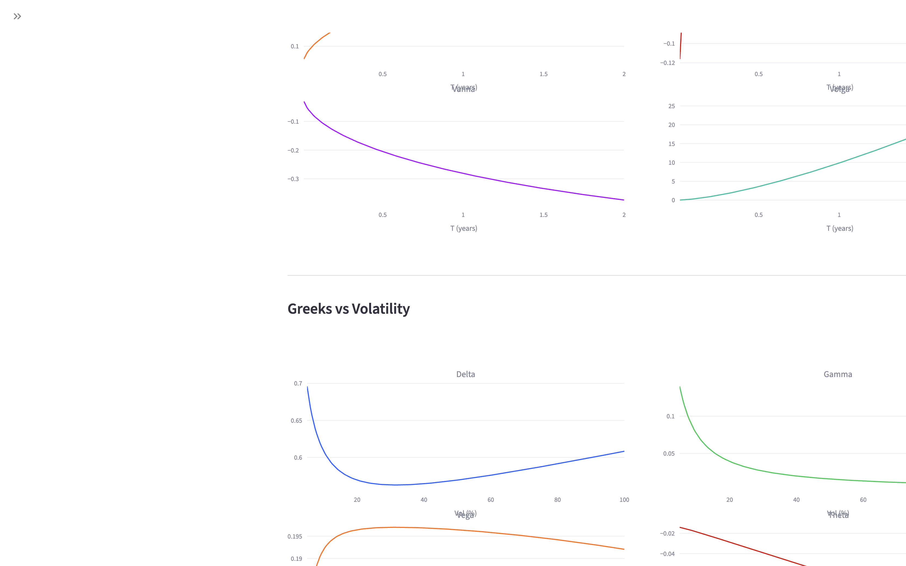
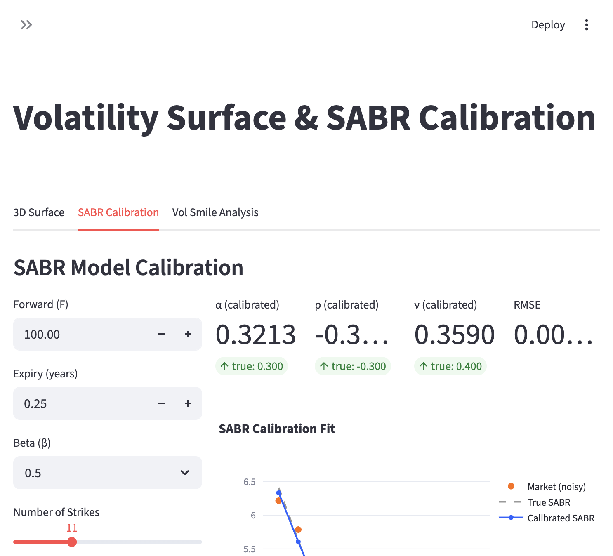
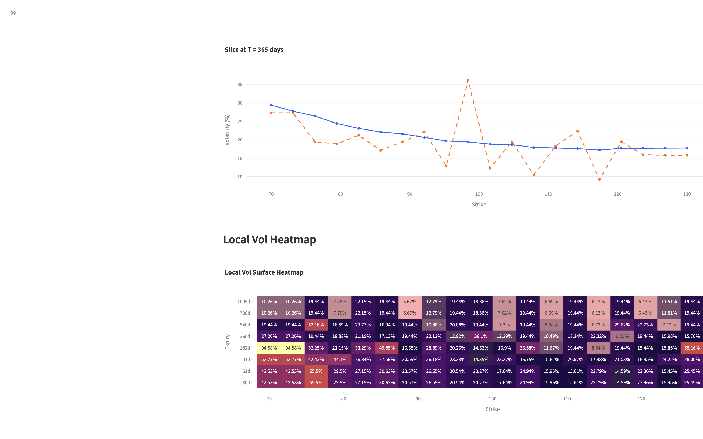
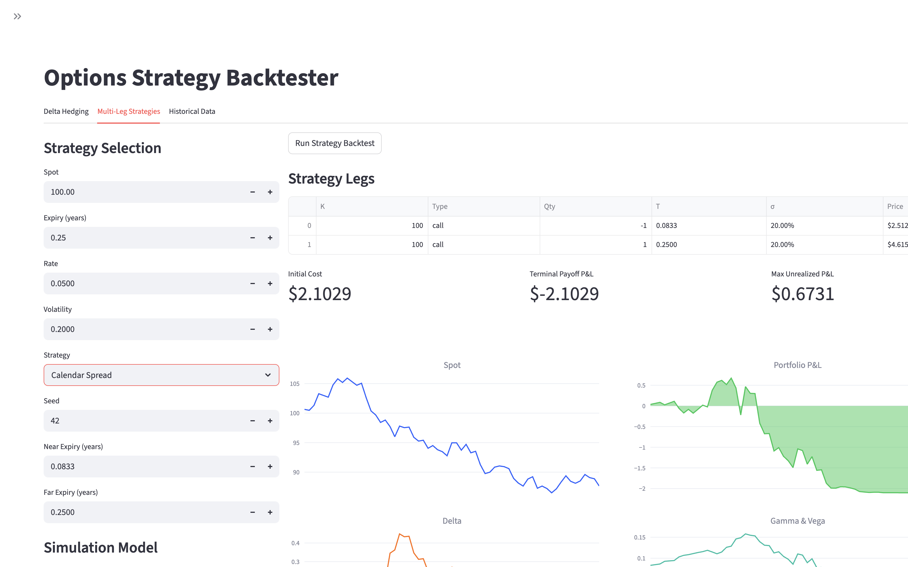
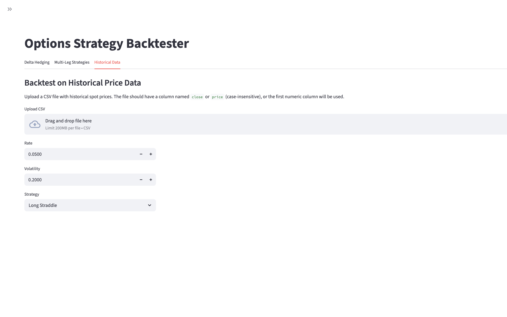
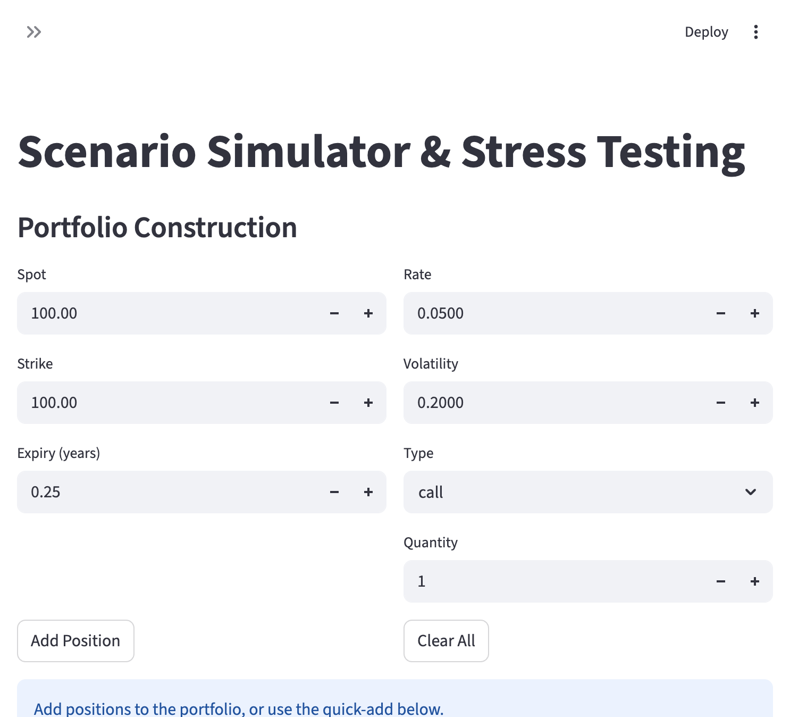
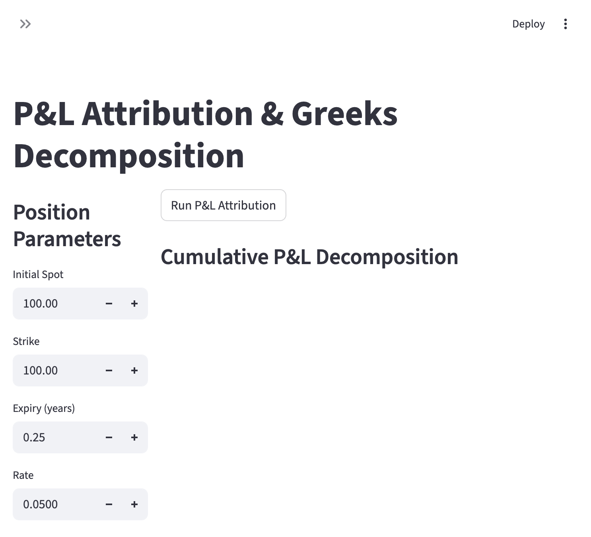

# Quantitative Options Analysis Toolkit: A Containerized Platform for Front-Office Derivatives Analytics

## Abstract

This paper presents the Quantitative Options Analysis Toolkit (QOAT), an integrated, containerized web application designed to support the full workflow of a front-office quantitative analyst on an options trading desk. The system encompasses six functional modules—options pricing, volatility surface modeling, strategy backtesting, scenario simulation, profit-and-loss attribution, and real-time risk monitoring—deployed within a Docker container for reproducible, environment-independent operation. Built entirely in Python with a Streamlit-based interactive dashboard, QOAT implements industry-standard quantitative models including Black-Scholes analytical pricing, the Heston stochastic volatility model via characteristic function integration, Dupire local volatility extraction and Monte Carlo pricing, SABR volatility calibration (Hagan et al., 2002), and full second-order Taylor-expansion-based P&L decomposition with Vanna and Volga terms. The system supports both simulated (GBM, Heston) and historical data backtesting, portfolio-level P&L attribution, and multi-dimensional Greeks sensitivity analysis. This paper describes the system architecture, the mathematical foundations underlying each module, the implementation methodology, and representative use cases drawn from options market-making and proprietary trading contexts.

## 1. Introduction

Modern options market-making and proprietary trading desks require a tightly integrated suite of quantitative tools that span the entire trade lifecycle—from pre-trade analytics and model calibration through real-time risk monitoring to post-trade performance attribution. Quantitative analysts ("quants") operating in this environment must bridge the gap between theoretical derivatives pricing models and the practical demands of a live trading operation, including accurate volatility fitting, robust strategy backtesting, rapid scenario analysis, and rigorous P&L explanation.

Despite the availability of commercial platforms such as Bloomberg DLIB, Murex, and Calypso, there remains a persistent need for lightweight, customizable, Python-native toolkits that can be rapidly prototyped, iterated upon, and deployed alongside production C++ pricing libraries. Such tools serve as the research and prototyping layer that quants use to validate new models before handing them off to developers for productionization.

The Quantitative Options Analysis Toolkit (QOAT) addresses this need by providing a modular, Dockerized platform with six core functional areas:

1. **Options Pricer & Greeks Calculator** — Multi-model pricing (Black-Scholes, Heston, Dupire Local Vol) with full analytical and numerical Greeks and multi-dimensional sensitivity profiles
2. **Volatility Surface & SABR Calibration** — 3D implied and local volatility surface construction, SABR calibration, and Dupire local vol extraction
3. **Strategy Backtester** — Delta hedging under GBM or Heston dynamics, multi-leg strategy evaluation with per-leg expiry support, and historical data backtesting
4. **Scenario Simulator & Stress Testing** — Portfolio-level what-if analysis across multiple risk dimensions
5. **P&L Attribution** — Full second-order Taylor decomposition (Delta, Gamma, Vega, Theta, Vanna, Volga) for single positions and multi-position portfolios
6. **Risk Dashboard** — Portfolio monitoring with Monte Carlo VaR/CVaR, Greeks exposure, and configurable alerts

The remainder of this paper is organized as follows: Section 2 describes the system architecture and deployment model. Sections 3 through 8 detail each module's mathematical foundations and implementation. Section 9 discusses the technology stack, and Section 10 concludes with directions for future development.

## 2. System Architecture

### 2.1 Deployment Model

QOAT is packaged as a single Docker container, ensuring environment-independent reproducibility. The `docker-compose.yml` configuration exposes the application on port 8501 with a volume mount for live code reloading during development:

```yaml
services:
  quant-tool:
    build: .
    container_name: quant-options-toolkit
    ports:
      - "8501:8501"
    volumes:
      - .:/app
    environment:
      - STREAMLIT_SERVER_RUN_ON_SAVE=true
```

The Docker image is based on `python:3.11-slim` with a health check endpoint to support orchestration and monitoring.

### 2.2 Application Structure

The codebase follows a clean separation between core quantitative logic and presentation:

```
quant-tool/
├── Home.py                      # Main entry point and navigation
├── pages/
│   ├── 1_Options_Pricer.py
│   ├── 2_Volatility_Surface.py
│   ├── 3_Strategy_Backtester.py
│   ├── 4_Scenario_Simulator.py
│   ├── 5_PnL_Attribution.py
│   └── 6_Risk_Dashboard.py
├── core/
│   ├── pricing.py               # BS + Heston pricing engines
│   ├── greeks.py                # Analytical and numerical Greeks
│   ├── volatility.py            # SABR model + vol surface construction
│   ├── backtesting.py           # Simulation and backtest engines
│   ├── scenarios.py             # Scenario and stress testing
│   └── pnl.py                   # P&L attribution engine
├── Dockerfile
├── docker-compose.yml
└── requirements.txt
```

This separation ensures that the `core/` modules can be independently tested, imported into Jupyter notebooks for ad hoc research, or compiled as a standalone library.

### 2.3 Home Page

The home page provides an overview of all available modules and their capabilities, serving as a central navigation hub.


## 3. Module 1: Options Pricer & Greeks Calculator

### 3.1 Black-Scholes Pricing

The foundation of the pricing engine is the Black-Scholes (1973) closed-form solution for European options:

$$C = S \, \Phi(d_1) - K e^{-rT} \Phi(d_2)$$

$$P = K e^{-rT} \Phi(-d_2) - S \, \Phi(-d_1)$$

where:

$$d_1 = \frac{\ln(S/K) + (r + \sigma^2/2)T}{\sigma\sqrt{T}}, \quad d_2 = d_1 - \sigma\sqrt{T}$$

Implied volatility is recovered via Brent's root-finding algorithm over the interval $[\epsilon, 10]$.

### 3.2 Analytical Greeks

The system computes nine analytical Greeks:

| Greek | Formula | Interpretation |
|-------|---------|---------------|
| Delta ($\Delta$) | $\Phi(d_1)$ (call) | Sensitivity to spot price |
| Gamma ($\Gamma$) | $\phi(d_1) / (S\sigma\sqrt{T})$ | Curvature of delta |
| Vega ($\mathcal{V}$) | $S \phi(d_1) \sqrt{T}$ | Sensitivity to volatility |
| Theta ($\Theta$) | $-S\phi(d_1)\sigma/(2\sqrt{T}) - rKe^{-rT}\Phi(d_2)$ | Time decay |
| Rho ($\rho$) | $KTe^{-rT}\Phi(d_2)$ | Sensitivity to rates |
| Vanna | $-\phi(d_1) d_2 / \sigma$ | Cross-sensitivity: delta to vol |
| Volga | $S\phi(d_1)\sqrt{T} \cdot d_1 d_2 / \sigma$ | Convexity of vega |
| Charm | $\partial\Delta / \partial T$ | Delta decay over time |
| Speed | $\partial\Gamma / \partial S$ | Rate of gamma change |

### 3.3 Multi-Dimensional Sensitivity Profiles

Beyond the standard Greeks-vs-spot profiles, the system provides sensitivity analysis across three dimensions:

- **Greeks vs Spot Price** — Standard sensitivity profiles across a configurable spot range
- **Greeks vs Time to Expiry** — Term structure of Greeks from near expiry to 2 years
- **Greeks vs Volatility** — Volatility sensitivity from 5% to 100% implied vol

Each dimension shows Delta, Gamma, Vega, Theta, Vanna, and Volga, enabling traders to understand how risk exposures evolve across different market regimes.





### 3.4 Heston Stochastic Volatility Model

For a more realistic treatment of volatility dynamics, QOAT implements the Heston (1993) model:

$$dS = \mu S \, dt + \sqrt{v} \, S \, dW_1$$

$$dv = \kappa(\theta - v) \, dt + \sigma_v \sqrt{v} \, dW_2$$

$$\text{Corr}(dW_1, dW_2) = \rho$$

Pricing is performed via numerical integration of the characteristic function using the Albrecher et al. formulation for numerical stability. The call price is obtained as:

$$C = S P_1 - K e^{-rT} P_2$$

where $P_j$ are probabilities computed via:

$$P_j = \frac{1}{2} + \frac{1}{\pi} \int_0^\infty \text{Re}\left[\frac{e^{-iu\ln K} \phi_j(u)}{iu}\right] du$$

The integral is evaluated using `scipy.integrate.quad` with adaptive quadrature up to 200 in the integration domain.


## 4. Module 2: Volatility Surface & SABR Calibration

### 4.1 Surface Construction

The volatility surface is constructed from a matrix of implied volatilities across strikes and expiries. Interpolation is performed via `scipy.interpolate.RectBivariateSpline` using cubic spline basis functions in both dimensions.

For demonstration and testing, the system generates synthetic surfaces with realistic features:

$$\sigma_{impl}(K, T) = \sigma_0 + \alpha \ln(K/S) + \beta [\ln(K/S)]^2 - \gamma\sqrt{T} + \epsilon$$

where $\alpha$ controls the skew, $\beta$ the smile convexity, and $\gamma$ the term structure flattening.

### 4.2 SABR Calibration

The SABR model (Hagan et al., 2002) provides a parametric approximation for the implied volatility smile:

$$\sigma_B(K, F) \approx \frac{\alpha}{(FK)^{(1-\beta)/2}} \cdot \frac{z}{x(z)} \cdot \left[1 + \left(\frac{(1-\beta)^2}{24}\frac{\alpha^2}{(FK)^{1-\beta}} + \frac{\rho\beta\nu\alpha}{4(FK)^{(1-\beta)/2}} + \frac{2-3\rho^2}{24}\nu^2\right)T\right]$$

The calibration routine minimizes the sum of squared differences between model and market implied volatilities using the Nelder-Mead simplex algorithm. The user can fix $\beta$ (commonly 0, 0.5, or 1) and calibrate $\alpha$, $\rho$, and $\nu$.




### 4.3 Dupire Local Volatility

The system extracts the Dupire (1994) local volatility surface from the implied volatility surface. The local vol is the unique state-dependent volatility function $\sigma_{loc}(S, t)$ that exactly reproduces all European option prices:

$$\sigma_{loc}^2(K, T) = \frac{\frac{\partial C}{\partial T} + rK\frac{\partial C}{\partial K}}{\frac{1}{2}K^2\frac{\partial^2 C}{\partial K^2}}$$

The implementation:

1. Converts the implied vol surface to a call price surface via Black-Scholes
2. Computes the partial derivatives $\partial C/\partial T$, $\partial C/\partial K$, and $\partial^2 C/\partial K^2$ via central finite differences
3. Applies the Dupire formula at each interior grid point
4. Extrapolates boundary values from the nearest interior row/column

The resulting local vol surface is visualized as both a 3D surface and a 2D heatmap, with a comparison slice showing implied vs local volatility at a selected expiry. A Monte Carlo pricer under local vol dynamics is also provided:

$$dS = rS\,dt + \sigma_{loc}(S, t)\,S\,dW$$

using interpolated local vol values at each time step.




## 5. Module 3: Strategy Backtester

### 5.1 Delta Hedging Simulation

The backtester simulates a delta-hedging strategy for a short option position under Geometric Brownian Motion (GBM):

$$S_{t+\Delta t} = S_t \exp\left[\left(\mu - \frac{\sigma^2}{2}\right)\Delta t + \sigma\sqrt{\Delta t}\, Z\right]$$

At each rebalancing interval, the hedge portfolio is adjusted to match the current Black-Scholes delta. The simulation tracks daily P&L components:

- **Hedge P&L**: $\Delta \times dS$
- **Option P&L**: $-(V_{t+1} - V_t)$
- **Interest**: $\text{Cash} \times r \times dt$

Users can vary the hedge frequency (daily, every 2, 5, 10, or 20 days) to observe the impact of discrete hedging on P&L variance.

### 5.2 Delta Hedging Under Heston Dynamics

The system also supports delta hedging under Heston stochastic volatility dynamics, creating a realistic volatility mismatch scenario. The underlying follows Heston dynamics while hedging uses Black-Scholes delta with a fixed hedge volatility. This enables analysis of:

- P&L from vol mismatch (hedging with wrong model)
- Impact of stochastic vol on discrete hedging effectiveness
- Realized vs implied volatility tracking


### 5.3 Multi-Leg Strategy Evaluation

Eight pre-built strategy templates are available:

- Long/Short Straddle
- Long Strangle
- Bull Call Spread / Bear Put Spread
- Long Butterfly
- Iron Condor
- Calendar Spread (with per-leg expiry: short near-term, long far-term)

Each strategy supports per-leg expiry and volatility parameters, enabling proper modeling of calendar spreads and other multi-expiry structures. Strategies can be simulated under either GBM or Heston dynamics, with full tracking of portfolio value, delta, gamma, theta, and vega over time.



### 5.4 Historical Data Backtesting

The backtester accepts uploaded CSV files with historical spot price data. The system automatically detects the price column (looking for "close", "price", or the first numeric column) and runs the selected strategy against the real price path. This enables:

- Validation of strategies against actual market conditions
- Comparison of simulated vs historical P&L behavior
- Pattern identification in real data




## 6. Module 4: Scenario Simulator & Stress Testing

### 6.1 Spot × Vol P&L Heatmap

The core scenario analysis tool generates a two-dimensional grid of P&L outcomes by simultaneously bumping the spot price and implied volatility:

$$\text{P\&L}(\Delta S, \Delta\sigma) = V(S + \Delta S, \sigma + \Delta\sigma) - V(S, \sigma)$$

The resulting heatmap provides immediate visual insight into the portfolio's directional and volatility exposure.

### 6.2 Stress Testing

Ten pre-configured stress scenarios cover a range of market conditions:

| Scenario | Spot | Vol | Time |
|----------|------|-----|------|
| Crash | -20% | +15pp | 0 |
| Rally | +20% | -10pp | 0 |
| Tail Risk | -30% | +25pp | 0 |
| 1 Week Decay | 0% | 0pp | 7d |
| 1 Month Decay | 0% | 0pp | 30d |

For each scenario, the system reports the new portfolio value, P&L, and the resulting Greeks (delta, gamma, vega).

### 6.3 Spot Ladder and Theta Decay

Additional analysis tools include:

- **Spot Ladder**: P&L and Greeks as a function of the underlying price across a configurable range
- **Theta Decay**: Portfolio value and Greeks evolution over a forward-looking time horizon



## 7. Module 5: P&L Attribution

### 7.1 Greeks-Based Decomposition

P&L attribution decomposes the daily change in option value using a full second-order Taylor expansion including cross-Greeks:

$$dV \approx \Delta \cdot dS + \frac{1}{2}\Gamma \cdot dS^2 + \mathcal{V} \cdot d\sigma + \Theta \cdot dt + \text{Vanna} \cdot dS \cdot d\sigma + \frac{1}{2}\text{Volga} \cdot d\sigma^2 + \text{Unexplained}$$

Each component is computed using the previous day's Greeks and the observed changes in spot price and implied volatility. The Vanna term captures the cross-sensitivity between spot and vol movements, while the Volga term captures the convexity of vega. The "unexplained" residual captures third-order effects and model error, and is significantly reduced compared to a first-order-only decomposition.

### 7.2 Simulation Framework

For demonstration purposes, the system generates synthetic spot and implied volatility paths:

$$S_{t+1} = S_t + S_t(r \cdot dt + \sigma_S \cdot Z_1)$$

$$\sigma_{t+1} = \max(\sigma_t + \sigma_{drift} \cdot Z_2, \, 0.05)$$

where $Z_1, Z_2$ are independent standard normal variates. Users control the daily spot volatility ($\sigma_S$) and the implied volatility drift ($\sigma_{drift}$).

### 7.3 Portfolio-Level Attribution

In addition to single-position analysis, the system supports portfolio-level P&L attribution across multiple positions sharing the same underlying. Users construct a portfolio of positions (each with its own strike, expiry, vol, type, and quantity), and the system:

1. Generates a shared spot price path
2. Generates per-position implied vol paths (with position-specific initial levels)
3. Computes per-position P&L attribution with all six Greek components
4. Aggregates into a portfolio-level decomposition

Per-position breakdowns are available in expandable detail views.


### 7.4 Output

The module produces:

- **Cumulative P&L stacked area chart** — Delta, Gamma, Vega, Theta, Vanna, Volga, and Unexplained components
- **Daily P&L bar chart** — Component-level breakdown per day with actual P&L overlay
- **Greeks evolution** — Time series of Delta, Gamma, Vega, and Theta
- **Summary statistics** — Total, mean, standard deviation, min, max, and annualized Sharpe ratio for each component
- **Portfolio view** — Aggregate and per-position attribution for multi-position books




## 8. Module 6: Risk Dashboard

### 8.1 Portfolio Overview

The risk dashboard provides a real-time view of a multi-position options book. A pre-loaded sample book contains six positions spanning calls and puts across three expiry buckets (1M, 3M, 6M) with varying moneyness. The top-level metrics display:

- Total portfolio value
- Net Delta, Gamma, Vega, Theta, Vanna, and Volga

### 8.2 Value at Risk

Monte Carlo VaR is computed by simulating spot price returns over the specified horizon:

$$S_T = S_0 \exp\left(\bar{\sigma}\sqrt{\Delta t} \cdot Z\right)$$

For each simulated terminal spot, the portfolio is repriced and the P&L distribution is constructed. VaR and CVaR (Expected Shortfall) are extracted at the user-specified confidence level (90%–99%).

The system also reports the full P&L percentile table (1st through 99th percentile).

### 8.3 Greeks Exposure Analysis

Portfolio-level Greeks are broken down by:

- **Expiry bucket** — Delta, Gamma, Vega, and Theta by time-to-maturity
- **Strike bucket** — Greeks grouped by option strike price

### 8.4 Risk Alerts

Configurable risk limits are applied to:

- Net Delta, Gamma, Vega, and Theta (absolute value thresholds)
- VaR (maximum loss threshold)

Breaches are highlighted with red (error) or yellow (warning) indicators and summarized in a risk status table.


## 9. Technology Stack

| Component | Technology | Rationale |
|-----------|-----------|-----------|
| Language | Python 3.11 | Industry standard for quant prototyping |
| Web Framework | Streamlit | Rapid dashboard development, native Python |
| Numerical | NumPy, SciPy | Efficient numerical computation, optimization, integration |
| Data | Pandas | Time-series and tabular data management |
| Visualization | Plotly | Interactive 3D surfaces, charts, heatmaps |
| Containerization | Docker | Reproducible, portable deployment |

All dependencies are managed via `requirements.txt` with version pinning. The total image size is approximately 500 MB, and the application starts within 10 seconds of container launch.

## 10. Limitations and Future Work

### 10.1 Current Limitations

- **Synthetic data only**: The current implementation uses generated data for demonstration. Integration with live market data feeds (e.g., via WebSocket APIs from exchanges or Bloomberg B-PIPE) would be required for production use.
- **Single-threaded computation**: Heston model pricing and Monte Carlo VaR are computed serially. Parallelization via `multiprocessing` or `concurrent.futures` would improve performance for large portfolios.
- **No persistence layer**: Portfolio positions and calibration parameters are stored in Streamlit session state and are lost on page refresh. A database backend (PostgreSQL or Redis) would provide persistence.

### 10.2 Planned Extensions

- **SLV (Stochastic Local Volatility)** hybrid models combining Heston and Dupire
- **C++ pricing kernel** via `pybind11` for latency-sensitive computations, reflecting the production environment where Python prototypes are handed off to C++ developers
- **Real-time data integration** with WebSocket streaming from cryptocurrency or equity options exchanges
- **Greeks hedging optimizer** for automated portfolio rebalancing
- **Multi-asset correlation** and cross-gamma analysis for portfolio-level risk
- **Trade execution analysis** — slippage estimation, fill rate tracking, and pre-trade impact models

## 11. Conclusion

The Quantitative Options Analysis Toolkit demonstrates that a comprehensive, interactive front-office quant platform can be built entirely in Python and deployed as a single Docker container. With three pricing models (Black-Scholes, Heston, Dupire Local Vol), full second-order P&L attribution including Vanna and Volga, portfolio-level analysis, historical data backtesting, and multi-regime simulation (GBM and Heston), QOAT covers the full spectrum from model calibration through risk monitoring. It provides a cohesive environment for the daily workflow of a quantitative analyst supporting an options market-making desk. The modular architecture ensures that individual components can be independently tested, extended, and ultimately migrated to production-grade C++ implementations.

## References

- Black, F., & Scholes, M. (1973). The pricing of options and corporate liabilities. *Journal of Political Economy*, 81(3), 637–654.
- Dupire, B. (1994). Pricing with a smile. *Risk*, 7(1), 18–20. *(Implemented: local volatility extraction and Monte Carlo pricing)*
- Hagan, P. S., Kumar, D., Lesniewski, A. S., & Woodward, D. E. (2002). Managing smile risk. *Wilmott Magazine*, 1, 84–108.
- Heston, S. L. (1993). A closed-form solution for options with stochastic volatility with applications to bond and currency options. *Review of Financial Studies*, 6(2), 327–343.
- Ho, T., & Stoll, H. R. (1981). Optimal dealer pricing under transactions and return uncertainty. *Journal of Financial Economics*, 9(1), 47–73.
- Hull, J. C. (2022). *Options, Futures, and Other Derivatives* (11th ed.). Pearson.
- Merton, R. C. (1973). Theory of rational option pricing. *Bell Journal of Economics and Management Science*, 4(1), 141–183.

## Appendix A: Running the System

### Prerequisites
- Docker Desktop installed and running

### Quick Start

```bash
cd quant-tool/
docker compose up --build -d
```

The application will be available at `http://localhost:8501` within approximately 10 seconds.

### Stopping the System

```bash
docker compose down
```

### Development Mode

The volume mount in `docker-compose.yml` enables live code reloading. Edit any `.py` file and the Streamlit application will automatically refresh.
